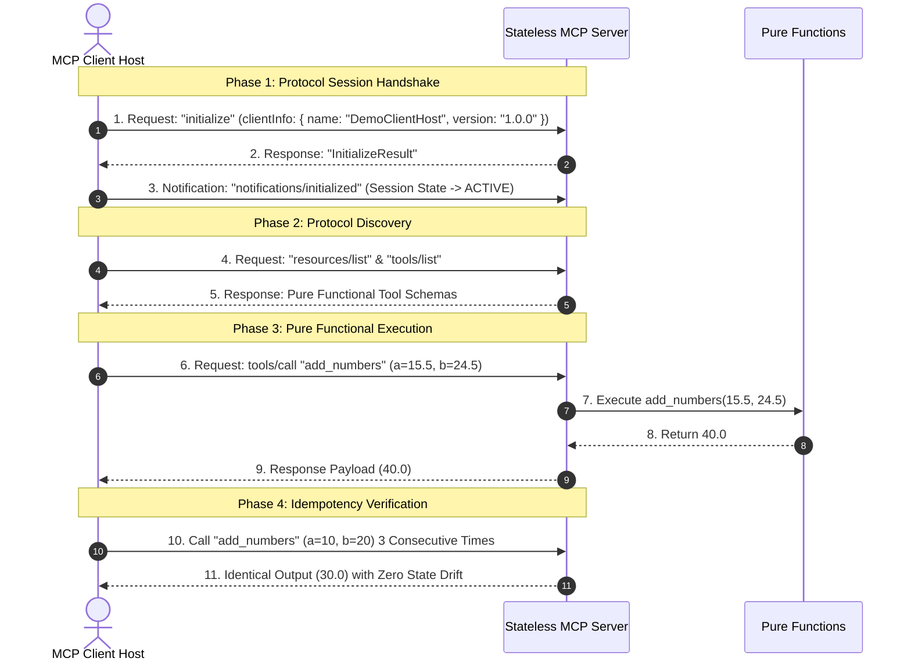

# ⚡ Stateless Model Context Protocol (MCP) Server Demo


A reference implementation of a **Stateless Model Context Protocol (MCP) Server** using the official Python [`FastMCP`](https://github.com/modelcontextprotocol/python-sdk) framework.

---

## 📖 Overview & Core Concepts

In the Model Context Protocol architecture, a **Stateless MCP Server** handles every client request, tool call, or resource access as an independent, isolated operation.

### Key Characteristics
* **Zero Side-Effects:** Tool execution never modifies internal memory, databases, or local files.
* **Pure Idempotency:** Executing a tool multiple times with the exact same input parameters produces identical results every time.
* **Horizontal Scalability:** Stateless servers can be scaled across multiple worker processes without state synchronization or locking overhead.
* **Ideal Use Cases:** Math calculations, text formatting, string/hash transformations, unit conversions, data validation, and static system metadata.

---

## ❓ Frequently Asked Protocol Questions

### 1. What is `notifications/initialized` and why is it a notification?
* **Protocol Handshake Phase 2**: In MCP, connection setup is a 2-phase exchange:
  1. Client sends `initialize` request $\rightarrow$ Server returns `InitializeResult` (capabilities, protocol version, server info).
  2. Client sends `notifications/initialized` $\rightarrow$ A 1-way JSON-RPC notification (no `id` field, no response expected).
* **State Transition Signal**: Per the MCP protocol specification, before `notifications/initialized` is received, the server is in the **`INITIALIZING`** state and MUST NOT send requests or push notifications to the client. Sending `notifications/initialized` confirms that client setup is complete and transitions the session state to **`ACTIVE`**.

### 2. Why must Schema Discovery (`resources/list` & `tools/list`) occur before Execution?
In proper MCP client implementation, the host client must discover what URIs (`resources/list`) and functions (`tools/list`) exist BEFORE issuing `resources/read` or `tools/call`. Executing discovery first ensures that tool arguments strictly conform to published JSON schemas (`inputSchema`).

---

## 📐 Architecture & Request Flow



---

## 🎨 ANSI Terminal Color Visualization Legend

The interactive walkthrough script (`test_client.py`) uses color-coded output for terminal presentations:

| UI Element | Color Scheme | Visual Purpose |
| :--- | :--- | :--- |
| **📤 JSON-RPC Requests** | **Bright Cyan** | Clearly highlights outgoing client payloads (`{"method": "tools/call", ...}`) |
| **📥 JSON-RPC Responses** | **Bright Green** | Highlights incoming server result payloads (`{"result": ...}`) |
| **📡 Async Notifications** | **Bright Magenta** | Distinguishes stream push notifications (`notifications/message`) |
| **👨‍💻 Technical Architect** | **Bright Yellow** | Emphasizes architectural commentary and protocol insights |
| **📍 Server Code Pointers** | **Bright Magenta** | Directs focus to exact `server.py` line numbers |
| **⚙️ Chapter Headers** | **Bright Blue & Bold** | Clean visual separation between walkthrough chapters |
| **▶️ Action Prompt** | **Bold White** | Clearly indicates when to press `ENTER` to step forward |

---

## 🛠️ API Reference

### 1. Tools

| Tool Name | Arguments | Output Type | Description |
| :--- | :--- | :--- | :--- |
| `add_numbers` | `a: float`, `b: float` | `float` | Adds two floating-point numbers. |
| `calculate_bmi` | `weight_kg: float`, `height_m: float` | `dict` | Computes BMI index and classifies weight category. |
| `transform_text` | `text: str`, `operation: str` | `dict` | Transforms text (`uppercase`, `lowercase`, `reverse`, `word_count`, `sha256`). |
| `convert_units` | `value: float`, `from_unit: str`, `to_unit: str` | `dict` | Converts units (`celsius`/`fahrenheit`, `meters`/`feet`, `kg`/`lbs`). |

---

### 2. Resources

| Resource URI | MIME Type | Description |
| :--- | :--- | :--- |
| `system://info` | `application/json` | Provides read-only runtime system information (Python version, OS architecture, platform). |

---

## 💻 Source Code Structure

* [`server.py`](./server.py): Main MCP server implementation defined with `FastMCP`.
* [`test_client.py`](./test_client.py): Automated interactive walkthrough script displaying raw JSON-RPC 2.0 payloads, ANSI terminal colors, and `server.py` line pointers.

---

## 🚀 How to Run

```bash
# Interactive Presentation Mode (Press ENTER to advance each step):
python3 test_client.py

# Fast Auto Mode (Runs without pausing):
python3 test_client.py --auto
```
