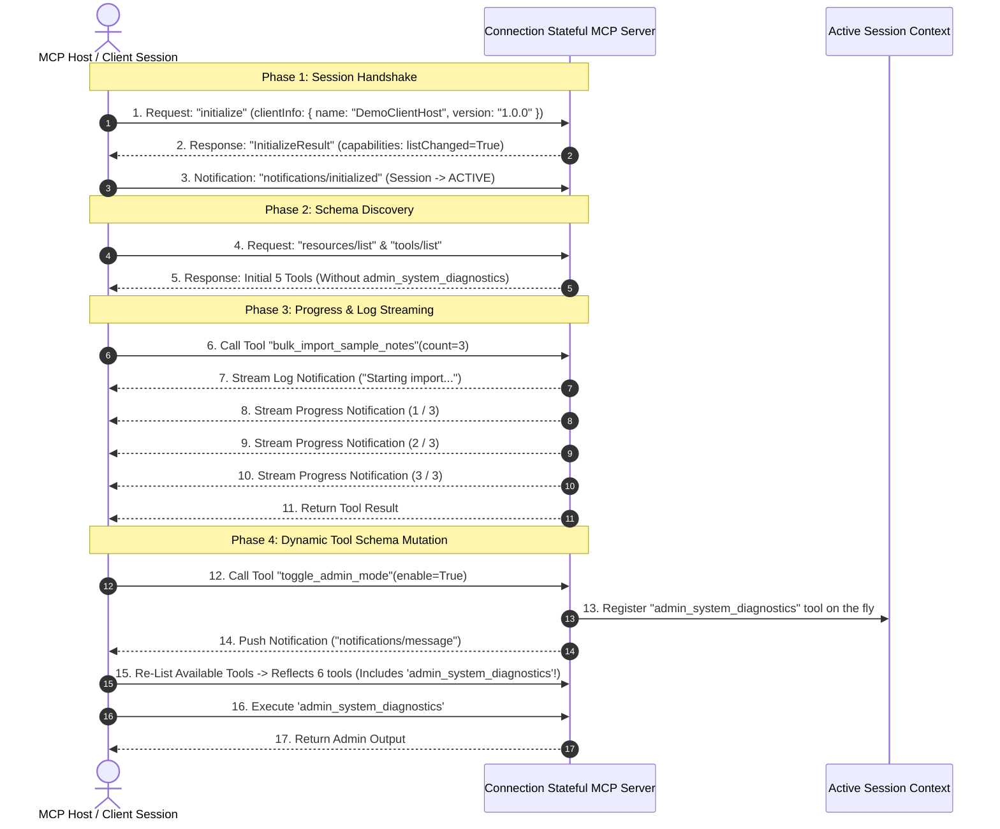

# 📡 Option 1: Protocol Connection Stateful MCP Server Demo


A reference implementation demonstrating **Option 1: Native MCP Protocol Connection & Session Statefulness** using Python [`FastMCP`](https://github.com/modelcontextprotocol/python-sdk).

---

## 💡 What is Protocol Connection Statefulness?

In MCP, **Protocol Connection Statefulness** leverages native connection session mechanisms established between the client and server during the `initialize` handshake over persistent transports (`stdio` or `HTTP SSE`):

1. **Session Context & Lifetime Tracking:** Captures connection metadata (`client_id`, `request_id`, connection session start timestamp, active session uptime).
2. **Real-Time Stream Connection Logging (`ctx.info()`, `ctx.warning()`):** Server pushes `notifications/message` events over the active stream while processing tool calls.
3. **Real-Time Progress Streaming (`ctx.report_progress(current, total)`):** Streams granular execution progress (e.g. `1/3 -> 2/3 -> 3/3`) over the connection stream.
4. **Dynamic Tool Mutation over Connection (`notifications/tools/list_changed`):** When server session state changes (e.g. calling `toggle_admin_mode(True)`), the server dynamically registers new tools (`admin_system_diagnostics`) into the active session and notifies the client over the connection stream.
5. **Connection Resource Views (`notes://all`, `session://info`):** Exposes live resources representing state during the active connection lifecycle.

---

## ❓ Frequently Asked Protocol Questions

### 1. What is `notifications/initialized` and why is it a notification?
* **Protocol Handshake Phase 2**: In MCP, connection setup is a 2-phase exchange:
  1. Client sends `initialize` request $\rightarrow$ Server returns `InitializeResult` (capabilities, protocol version, server info).
  2. Client sends `notifications/initialized` $\rightarrow$ A 1-way JSON-RPC notification (no `id` field, no response expected).
* **State Transition Signal**: Per the MCP protocol specification, before `notifications/initialized` is received, the server is in the **`INITIALIZING`** state and MUST NOT send requests or push notifications to the client. Sending `notifications/initialized` confirms that client setup is complete and transitions the session state to **`ACTIVE`**.

### 2. Why does the server explicitly declare `capabilities` in `InitializeResult`?
During the `initialize` handshake, the stateful server declares its notification capabilities so the client host knows that tools and resources can change dynamically during the session:

```json
📥 [RAW JSON-RPC 2.0 RESPONSE PAYLOAD]:
{
  "jsonrpc": "2.0",
  "id": 1,
  "result": {
    "protocolVersion": "2025-11-25",
    "capabilities": {
      "tools": { "listChanged": true },
      "resources": { "listChanged": true },
      "prompts": { "listChanged": true }
    },
    "serverInfo": {
      "name": "Protocol Connection Stateful MCP Server",
      "version": "1.28.1"
    }
  }
}
```

### 3. Why must Schema Discovery (`resources/list` & `tools/list`) occur before Execution?
In proper MCP client implementation, the host client must discover what URIs (`resources/list`) and functions (`tools/list`) exist BEFORE issuing `resources/read` or `tools/call`. Executing discovery first ensures that tool arguments strictly conform to published JSON schemas (`inputSchema`).

---

## 📐 Connection Architecture & Flow



---

## 🎨 ANSI Terminal Color Visualization Legend

The interactive walkthrough script (`test_client.py`) uses color-coded output for terminal presentations:

| UI Element | Color Scheme | Visual Purpose |
| :--- | :--- | :--- |
| **📤 JSON-RPC Requests** | **Bright Cyan** | Clearly highlights outgoing client payloads (`{"method": "tools/call", ...}`) |
| **📥 JSON-RPC Responses** | **Bright Green** | Highlights incoming server result payloads (`{"result": ...}`) |
| **📡 Async Notifications** | **Bright Magenta** | Distinguishes stream push notifications (`notifications/message`) |
| **👨‍💻 Technical Architect** | **Bright Yellow** | Emphasizes architectural commentary and protocol insights |
| **📍 Server Code Pointers** | **Bright Magenta** | Directs focus to exact `server.py` line numbers |
| **⚙️ Chapter Headers** | **Bright Blue & Bold** | Clean visual separation between walkthrough chapters |
| **▶️ Action Prompt** | **Bold White** | Clearly indicates when to press `ENTER` to step forward |

---

## 🛠️ API Reference

### 1. Connection-Aware Tools

| Tool Name | Parameters | Description |
| :--- | :--- | :--- |
| `get_connection_session_info` | None | Inspects active MCP connection parameters (`client_id`, `request_id`, session start time). |
| `bulk_import_sample_notes` | `count: int` | Demonstrates real-time progress streaming (`ctx.report_progress`) & connection log streaming (`ctx.info`). |
| `toggle_admin_mode` | `enable: bool` | Dynamically registers/removes the `admin_system_diagnostics` tool over the connection session. |
| `admin_system_diagnostics` | None | Dynamically enabled privileged tool (only available when `admin_mode` is `True`). |
| `create_note` | `title: str`, `content: str`, `tags: list[str]` | Creates note while emitting connection log notifications. |
| `clear_notes` | None | Resets note store. |

---

### 2. Connection Resources

| Resource URI | Description |
| :--- | :--- |
| `session://info` | Dynamic resource displaying connection session metadata, admin state, and uptime. |
| `notes://all` | Live resource stream of all active notes created during the session. |

---

## 💻 Source Code Structure

* [`server.py`](./server.py): Protocol connection stateful server using `FastMCP` and `Context`.
* [`test_client.py`](./test_client.py): Automated interactive walkthrough script demonstrating connection handshake, raw JSON-RPC payloads, real-time log/progress streams, dynamic tool registration, and resource reading over stdio.

---

## 🚀 How to Run

```bash
# Interactive Presentation Mode (Press ENTER to advance each step):
python3 test_client.py

# Fast Auto Mode (Runs without pausing):
python3 test_client.py --auto
```
