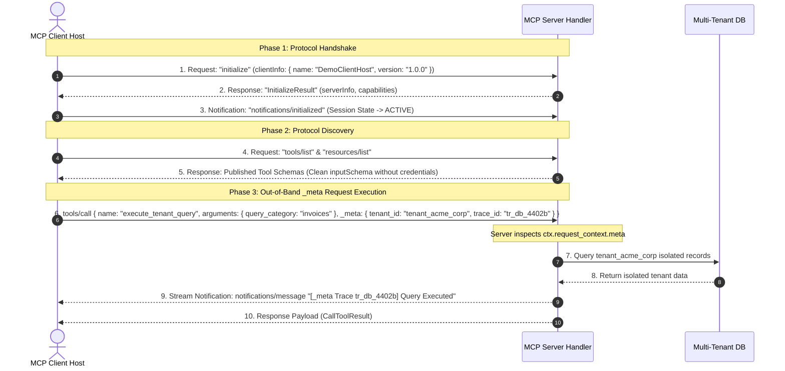

# Demo 03: MCP Request Metadata (`_meta`) Context Processing


## 📌 Executive Summary

In production Model Context Protocol (MCP) deployments, host applications must pass **out-of-band metadata**—such as caller credentials, tenant context, session tokens, and distributed trace IDs—without cluttering the functional argument schema (`inputSchema`) of tools and resources.

The MCP specification provides the reserved **`_meta` parameter object** inside JSON-RPC 2.0 request parameters (`params`).

This demo showcases:
1. **Out-of-Band Authentication**: Transporting `client_id`, `user_id`, and `auth_token` in `_meta` without exposing credentials in public tool schemas.
2. **Multi-Tenant Data Isolation**: Enforcing `tenant_id` boundaries at the handler level to prevent tenant impersonation.
3. **Distributed Tracing & Telemetry**: Correlating end-to-end trace IDs (`trace_id`) across async stream notifications and audit logs.

---

## ❓ Frequently Asked Protocol Questions

### 1. Why was `client_id` returning `null` / `None` initially?
* **Explanation**: In FastMCP (`Context.client_id`), the property reads from the request's out-of-band `_meta.client_id` parameter or session token. Over local `stdio` transport without an OAuth server, `ctx.client_id` defaults to `None`.
* **The Solution**: Passing `client_info=Implementation(name="DemoClientHost", version="1.0.0")` during `ClientSession` initialization populates `clientInfo` in the `initialize` payload. Furthermore, host clients inject `_meta: {"client_id": "client_acme_corp_88", ...}` into `params`, which `ctx.client_id` automatically extracts!

### 2. What is `notifications/initialized` and why is it a notification?
* **Protocol Handshake Phase 2**: In MCP, connection setup is a 2-phase exchange:
  1. Client sends `initialize` request $\rightarrow$ Server returns `InitializeResult` (capabilities, protocol version, server info).
  2. Client sends `notifications/initialized` $\rightarrow$ A 1-way JSON-RPC notification (no `id` field, no response expected).
* **State Transition Signal**: Per the MCP protocol specification, before `notifications/initialized` is received, the server is in the **`INITIALIZING`** state and MUST NOT send requests or push notifications to the client. Sending `notifications/initialized` confirms that client setup is complete and transitions the session state to **`ACTIVE`**.

### 3. Why must Schema Discovery (`resources/list` & `tools/list`) occur before Execution?
* In proper MCP client implementation, the host client must discover what URIs (`resources/list`) and functions (`tools/list`) exist BEFORE issuing `resources/read` or `tools/call`.
* Executing discovery first ensures that tool arguments strictly conform to published JSON schemas (`inputSchema`).

---

## 🏗️ Architecture & Protocol Sequence Flow



---

## 🎨 ANSI Terminal Color Visualization Legend

The interactive walkthrough script (`test_client.py`) uses color-coded output for terminal presentations:

| UI Element | Color Scheme | Visual Purpose |
| :--- | :--- | :--- |
| **📤 JSON-RPC Requests** | **Bright Cyan** | Clearly highlights outgoing client payloads (`{"method": "tools/call", "_meta": {...}}`) |
| **📥 JSON-RPC Responses** | **Bright Green** | Highlights incoming server result payloads (`{"result": ...}`) |
| **📡 Async Notifications** | **Bright Magenta** | Distinguishes stream push notifications (`notifications/message`) |
| **👨‍💻 Technical Architect** | **Bright Yellow** | Emphasizes architectural commentary and protocol insights |
| **📍 Server Code Pointers** | **Bright Magenta** | Directs focus to exact `server.py` line numbers |
| **⚙️ Chapter Headers** | **Bright Blue & Bold** | Clean visual separation between walkthrough chapters |
| **▶️ Action Prompt** | **Bold White** | Clearly indicates when to press `ENTER` to step forward |

---

## 🛠️ Key Handlers in `server.py`

| Handler Name | `_meta` Key Extracted | Server Code Location | Description |
| :--- | :--- | :--- | :--- |
| `get_user_profile` | `client_id`, `user_id`, `auth_token` | [server.py](./server.py#L60-L90) | Validates user identity and returns profile without requiring credentials in tool parameters. |
| `execute_tenant_query` | `tenant_id`, `trace_id` | [server.py](./server.py#L95-L125) | Restricts database execution strictly to `_meta.tenant_id`. |
| `audit_system_access` | `trace_id`, `user_id` | [server.py](./server.py#L130-L145) | Appends audit trail entry tagged with caller's trace span ID. |
| `audit://access_logs` | All `_meta` audit logs | [server.py](./server.py#L150-L158) | Resource returning full audit trail correlated by trace IDs. |

---

## 💻 Raw JSON-RPC 2.0 Payload Examples

### Out-of-Band `_meta` Request Payload (`tools/call`)

```json
📤 [RAW JSON-RPC 2.0 REQUEST PAYLOAD]:
{
  "jsonrpc": "2.0",
  "id": 4,
  "method": "tools/call",
  "params": {
    "name": "get_user_profile",
    "arguments": {
      "include_security_groups": true
    },
    "_meta": {
      "client_id": "client_acme_corp_88",
      "user_id": "usr_stenalp_42",
      "tenant_id": "tenant_acme_corp",
      "trace_id": "tr_sec_9901a",
      "auth_token": "bearer_sec_token_xyz123"
    }
  }
}
```

### Server JSON-RPC 2.0 Response Payload

```json
📥 [RAW JSON-RPC 2.0 RESPONSE PAYLOAD]:
{
  "jsonrpc": "2.0",
  "id": 4,
  "result": {
    "content": [
      {
        "type": "text",
        "text": "{\n  \"user_id\": \"usr_stenalp_42\",\n  \"client_id\": \"client_acme_corp_88\",\n  \"tenant_id\": \"tenant_acme_corp\",\n  \"trace_id\": \"tr_sec_9901a\",\n  \"auth_verified\": true,\n  \"profile\": {\n    \"name\": \"User usr_stenalp_42\",\n    \"role\": \"Senior Engineer\",\n    \"security_groups\": [\"devs\", \"mcp-operators\", \"sys-admins\"]\n  }\n}"
      }
    ],
    "isError": false
  }
}
```

---

## 🚀 Running the Interactive Technical Walkthrough

```bash
# Interactive Presentation Mode (Press ENTER to advance each step):
python3 ~/temp/mcp-architecture-and-extensions-demo/03_mcp_meta_context/test_client.py

# Fast Auto Mode (Runs without pausing):
python3 ~/temp/mcp-architecture-and-extensions-demo/03_mcp_meta_context/test_client.py --auto
```
